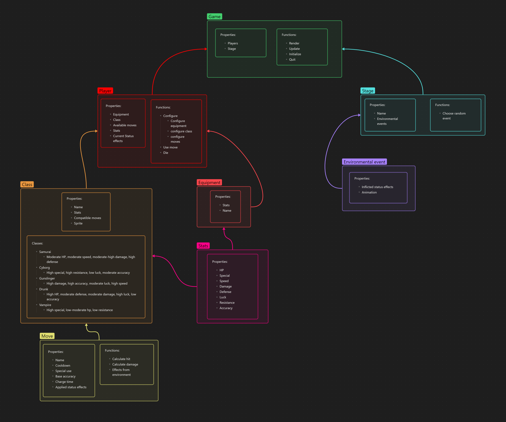

# RPG-Battler

**This game is currently WIP, so many features may not be implemented. See [issues](https://github.com/WhyNot180/RPG-Battler/issues) and [goals](#goals) for more info.

| **Table Of Contents** |
| --- |
| **[What is this game about?](#what-is-this-game-about)** |
| **[Installation](#installation)** |
| **[Playing the game](#playing-the-game)** |
| **[Design](#design)** |
| **[Goals](#goals)** |

## What is this game about?

This is an turn-based battler for 2 players. 
In the battler, players are able to test their tactical skills in 1v1 combat to determine who comes out on top.

Players can select from a set of classes, class specific moves, and stat-affecting equipment to create their own playstyle.

Players can then choose a stage with various environmental events that may affect the results of their attacks.

## Installation

Windows:

Download the [latest release](https://github.com/WhyNot180/RPG-Battler/releases/tag/v0.1.0-alpha) and extract the zip file. Then run RPG-Battler.exe.

Linux:

Download the [latest release](https://github.com/WhyNot180/RPG-Battler/releases/tag/v0.1.0-alpha) and extract the tar.gz file. Then run RPG-Battler.

## Playing the game

Currently, the game consists of only the move buttons, when pressed will perform the respective move and switch to the opponent's turn.

## Design
The initial game breakdown:

## Goals

- [x] Players
- Classes:
	- [ ] Samurai
	- [ ] Cyborg
	- [ ] Drunkard
	- [ ] Gunslinger
	- [x] Vampire
- [ ] Equipment
- [ ] Stages
	- [ ] Environmental events